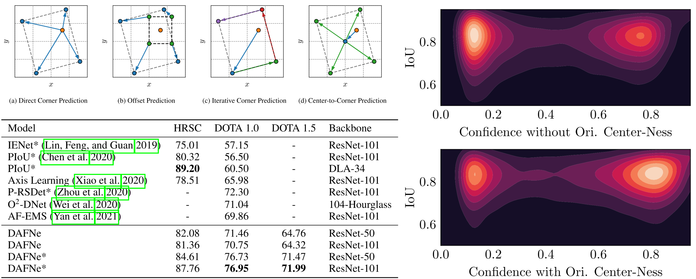

# DAFNe: A One-Stage Anchor-Free Deep Model for Oriented Object Detection




Code for our Paper [DAFNe: A One-Stage Anchor-Free Deep Model for Oriented Object Detection](https://arxiv.org/abs/2109.06148).
 	
[](https://paperswithcode.com/sota/one-stage-anchor-free-oriented-object-1?p=dafne-a-one-stage-anchor-free-deep-model-for)</br>
[](https://paperswithcode.com/sota/one-stage-anchor-free-oriented-object-2?p=dafne-a-one-stage-anchor-free-deep-model-for)</br>
[](https://paperswithcode.com/sota/one-stage-anchor-free-oriented-object-3?p=dafne-a-one-stage-anchor-free-deep-model-for)

## Datasets

- DOTA 1.0/1.5: https://captain-whu.github.io/DOTA/index.html
  - Note: See [./tools/prepare_dota/](./tools/prepare_dota/) for instructions on how to prepare the DOTA datasets.
- HRSC2016: https://www.kaggle.com/guofeng/hrsc2016

## Docker Setup

Use the `Dockerfile` to build the necessary docker image:

``` bash
docker build -t dafne .
```

## Training

Check out `./configs/` for different pre-defined configurations for the DOTA 1.0, DOTA 1.5 and HRSC2016 datasets. Use these paths as argument for the `--config-file` option below.


### With Docker

Use the `./tools/run.py` helper to start running experiments

``` bash
./tools/run.py --gpus 0,1,2,3 --config-file ./configs/dota-1.0/1024.yaml
```

### Without Docker

``` bash
NVIDIA_VISIBLE_DEVICES=0,1,2,3 ./tools/plain_train_net.py --num-gpus 4 --config-file ./configs/dota-1.0/1024.yaml
```

## Pre-Trained Weights

| Dataset  | mAP (%) | Config                                                          | Weights                                                                                               |
|----------|---------|-----------------------------------------------------------------|-------------------------------------------------------------------------------------------------------|
| HRSC2016 | 87.76   | [hrsc_r101_ms](./configs/pre-trained/hrsc_r101_ms.yaml)         | [hrsc-ms.pth](https://drive.google.com/file/d/1mzqcPTADlLpOJCTSanaweG-mgAbHtSOX/view?usp=sharing)     |
| DOTA 1.0 | 76.95   | [dota-1.0_r101_ms](./configs/pre-trained/dota-1.0_r101_ms.yaml) | [dota-1.0-ms.pth](https://drive.google.com/file/d/1-lgSLhKQSZBogI2YD0r64wjJV6k2xL4E/view?usp=sharing) |
| DOTA 1.5 | 71.99   | [dota-1.5_r101_ms](./configs/pre-trained/dota-1.5_r101_ms.yaml) | [dota-1.5-ms.pth](https://drive.google.com/file/d/1MQbTngieoWh-DcJL-z55RnI3PUNeSvBv/view?usp=sharing) |


### Pre-Trained Weights Usage with Docker

``` bash
./tools/run.py --gpus 0 --config-file <CONFIG_PATH> --opts "MODEL.WEIGHTS <WEIGHTS_PATH>"
```

### Pre-Trained Weights Usage without Docker

``` bash
NVIDIA_VISIBLE_DEVICES=0 ./tools/plain_train_net.py --num-gpus 1 --config-file <CONFIG_PATH> MODEL.WEIGHTS <WEIGHTS_PATH>
```

## Cite

``` bibtex
@misc{lang2021dafne,
      title={DAFNe: A One-Stage Anchor-Free Deep Model for Oriented Object Detection}, 
      author={Steven Lang and Fabrizio Ventola and Kristian Kersting},
      year={2021},
      eprint={2109.06148},
      archivePrefix={arXiv},
      primaryClass={cs.CV}
}
```


## Acknowledgments

- Thanks to [AdelaiDet](https://github.com/aim-uofa/AdelaiDet) for providing the initial FCOS implementation
- Thanks to [Detectron2](https://github.com/facebookresearch/detectron2) for providing a general object detection framework
